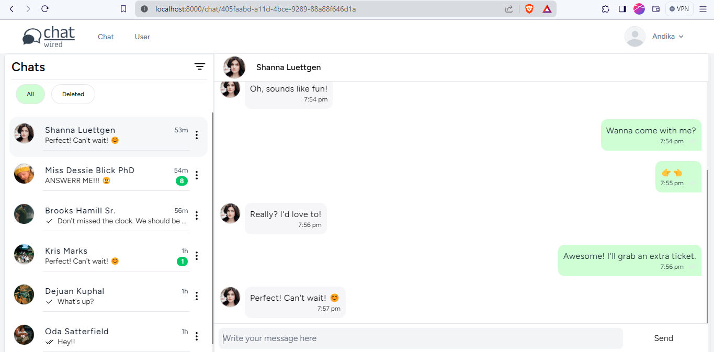

# **Wired - Livewire Chat**

Wired is a real-time messaging application developed with Laravel, Livewire, Alpine.js, and Pusher. It enables users to communicate instantly, offering features such as one-on-one chat, and real-time notifications.

## Getting Started!

First of all, copy **.env.example** file rename it to **.env**. Then rename the database
```bash
DB_DATABASE={{ database_name }}
DB_USERNAME={{ database_url }}
DB_PASSWORD={{ database_password }}
```
- Then, you'll need to [create a Pusher account](https://dashboard.pusher.com/) to access their services. <br>
- Create a channel for the chat app, [check out the documentation](https://pusher.com/docs/). <br>
- Once you create a channel, get the **app_key** and paste it to the **.env** file.<br>
```bash
PUSHER_APP_ID={{ YOUR_APP_ID }}
PUSHER_APP_KEY={{ YOUR_APP_KEY }}
PUSHER_APP_SECRET={{ YOUR_APP_SECRET }}
PUSHER_HOST={{ YOUR_APP_HOST }}
PUSHER_PORT=443
PUSHER_SCHEME=https
PUSHER_APP_CLUSTER={{ YOUR_APP_CLUSTER }}
```

Run composer install & npm install
```bash
composer install
npm install
```

Migrate the database
```bash
php artisan migrate
```


Run `make dev` this'll get all the jobs done for you!
```bash
make dev
```
> You could figure out what's going on under the hood in the Makefile

Open yout first terminal, and run the php server
```bash
php artisan serve
```

Open your second terminal and run the node server
```bash
npm run dev
```

Lastly, open your third terminal and run the laravel queue work
```bash
php artisan queue:work
```

Login with the default user
```bash
username = admin
password = password
```

Well, that's it! You can now chat with your crush. (if you have one) 😏

## Framework & Library

- PHP 8.1
- Laravel 10.x
- Laravel Livewire
- Laravel Echo
- AlpineJS

## Developer

- [Andika Dwi Saputra](https://andikss.github.io)